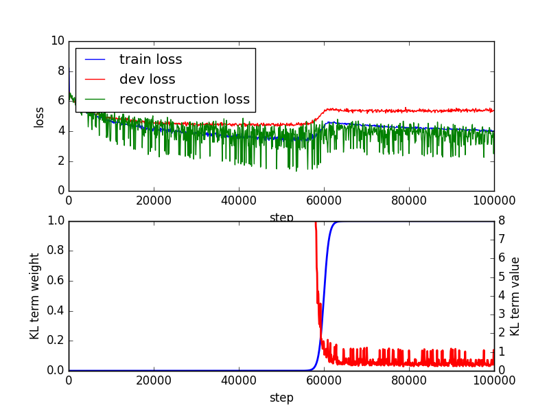

# Variational auto-encoder Language Model

VAE language model from paper [Generating Sentences from a Continuous Space](https://arxiv.org/abs/1511.06349)

Implemented by TensorFlow and tested on version 0.9

# Configurations

My configuration for the best model trained on the PTB dataset:



embedding_size: 350

num_units: 200

learning_rate: 2e-4

latent_dim: 13

batch_size: 64

max_steps: 100000

annealing_pivot: 60000

keep_prob: 0.75

# How to Run

## Train

```
python vaelm.py --embedding_size 350 --num_units 200 --learning_rate 2e-4 --latent_dim 13 --batch_size 64  --max_steps 1000000 --annealing_pivot 600000 --keep_prob 0.75 --data_dir ./data/ptb --save
```

## Sample

```
python vaelm.py --embedding_size 350 --num_units 200 --learning_rate 2e-4 --latent_dim 13 --batch_size 64  --max_steps 1000000 --annealing_pivot 600000 --keep_prob 1.0 ./data/ptb --eval
```

## Homotopy

```
python homotopy.py --embedding_size 350 --num_units 200 --learning_rate 2e-4 --latent_dim 13 --batch_size 64  --max_steps 1000000 --annealing_pivot 600000 --keep_prob 1.0 ./data/ptb
```


# Examples

These results are sampled from a model trained on [BookCorpus](http://www.cs.toronto.edu/~mbweb/)

## Sample (from entire latent space)

```
> do you want me to meet you ?
=> can you get me a drink ?
> do you want me to meet you ?
=> 'what do you mean by that ?
> do you want me to meet you ?
=> will you please come to me ?
> do you want me to meet you ?
=> thats what you are doing .
> do you want me to meet you ?
=> did n't you dare tell me .
```

## Hompotopy (Linear Interpolation)

```
[1]> do you want me to meet you ?
[2]> what are you two doing here ?
NUM > 3
> do you want me to meet you ?
> are you going to do it ?
> are you two people who are n't there ?
> `` is the <pad> of the <pad> who are you ?
> what are you two doing here ?
```

```
[1]> he was silent for a long moment .
[2]> it was my turn .
NUM > 4
> he was silent for a long moment .
> there was no one else .
> 'it 's a good thing , ' he said .
> 'it 's a good idea , ' said the old man said .
> this is the only one who 's the one who 's the one who knows .
> it was my turn .
```

# 中文

## 在隐变量空间随机采样

```
> 他一声：怎么回事？
=> 哟，你也看不上你。
> 他一声：怎么回事？
=> 薛嵩的?，?，又把她?。
> 他一声：怎么回事？
=> 的人呢？
> 他一声：怎么回事？
=> 小贱人，你还敢说什么呀？
> 他一声：怎么回事？
=> 我说：你怎么啦？
> 他一声：怎么回事？
=> 他赶紧跑去。
> 他一声：怎么回事？
=> 奴??：
> 他一声：怎么回事？
=> 薛嵩说：你怎么啦？
```

## 同伦(线性插值)

```
[1]> 他点点头，又笑了笑。
[2]> 我很傻，是不是？
NUM > 2
> 他 点点头 ， 又 笑了笑 。
> 我还说：你要干什么？
> 红线还说：老爷，你是大老爷。
> 我 很傻 ， 是不是 ？
```

```
[1]> 我很傻，是不是？
[2]> 为什么？
NUM > 2
> 我 很傻 ， 是不是 ？
> 我还以为她在哪里呢。
> ?老爷，你还能?吗？
> 为什么 ？
```

# Feedback

If you have some interesting results from this model, please let me know :p

# Licence

[Apache License 2.0](http://www.apache.org/licenses/LICENSE-2.0)
